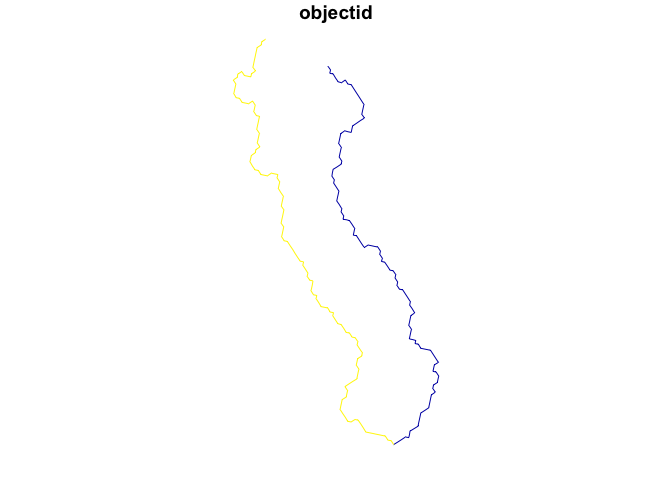

<!-- README.md is generated from README.Rmd. Please edit that file -->

# mapmaryland

<!-- badges: start -->

[](https://www.repostatus.org/#active)
[](https://opensource.org/licenses/MIT)
<!-- badges: end -->

The goal of mapmaryland is to ease access to spatial data for Maryland
at both the local, regional, and statewide level.

## Installation

You can install the development version of mapmaryland like so:

``` r
# pak::pkg_install("elipousson/mapmaryland")
```

## Example

``` r
library(mapmaryland)
```

Currently, the package has a limited number of data access functions,
prepackaged datasets, and reference data with an index of Maryland
ArcGIS services.

``` r
dplyr::glimpse(md_arcgis_index)
#> Rows: 78
#> Columns: 13
#> $ name         <chr> NA, NA, NA, "Baltimore City DPW", "Baltimore City DOT", N…
#> $ operator.abb <chr> NA, NA, NA, "DPW", "DOT", "BCIT", NA, "BCIT", "BCIT", "BC…
#> $ operator     <chr> NA, NA, NA, "Department of Public Works", NA, "Baltimore …
#> $ city         <chr> NA, NA, NA, "Baltimore", "Baltimore", "Baltimore", "Balti…
#> $ county       <chr> "Allegany County", "Anne Arundel County", "Anne Arundel C…
#> $ state        <chr> "Maryland", "Maryland", "Maryland", "Maryland", "Maryland…
#> $ state.abb    <chr> "MD", "MD", "MD", "MD", "MD", "MD", "MD", "MD", "MD", "MD…
#> $ geography    <chr> "countywide", "countywide", "countywide", "citywide", "ci…
#> $ source_type  <chr> "county government", "county government", "county governm…
#> $ notes        <chr> NA, NA, NA, NA, NA, NA, NA, "Used for Baltimore City CoDe…
#> $ public       <lgl> TRUE, TRUE, TRUE, TRUE, TRUE, TRUE, TRUE, TRUE, TRUE, TRU…
#> $ services_url <chr> "https://alleganygis.allconet.org/allcogis/rest/services"…
#> $ hosting      <chr> NA, NA, NA, NA, NA, NA, NA, NA, NA, NA, "ArcGIS Online", …
```

``` r
location <-
  get_md_tigris(
    name = "Hyattsville",
    type = "census places"
  )

location
#> Simple feature collection with 1 feature and 17 fields
#> Geometry type: MULTIPOLYGON
#> Dimension:     XY
#> Bounding box:  xmin: -8568784 ymin: 4713631 xmax: -8564592 ymax: 4719546
#> Projected CRS: WGS 84 / Pseudo-Mercator
#>    statefp countyfp placefp  placens   geoid        name         namelsad lsad
#> 90      24      033   41250 02390603 2441250 Hyattsville Hyattsville city   25
#>    classfp pcicbsa mtfcc funcstat   aland awater    intptlat     intptlon
#> 90      C1       N G4110        A 7005779  68516 +38.9612045 -076.9549346
#>                    county                       geometry
#> 90 Prince George's County MULTIPOLYGON (((-8568783 47...
```

``` r
streams <-
  get_water_data(
    location = location,
    type = "streams"
  )
#> ✔ Downloading "Rivers and Streams - Generalized" from
#>   <https://geodata.md.gov/imap/rest/services/Hydrology/MD_Waterbodies/FeatureServer/0>
#> Layer type: "Feature Layer"
#> 
#> Geometry type: "esriGeometryPolyline"
#> 
#> Service Coordinate Reference System: "EPSG:3857"
#> 
#> Output Coordinate Reference System: "EPSG:4326"

plot(streams, max.plot = 1)
```


